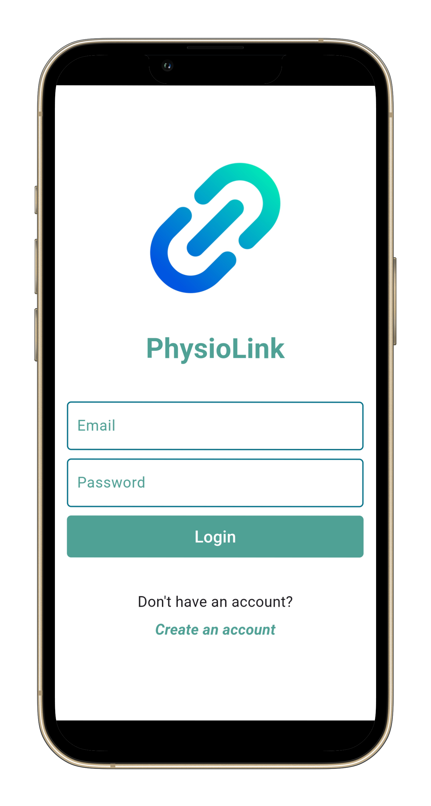
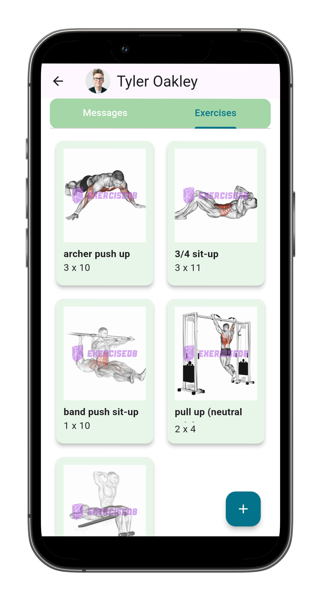
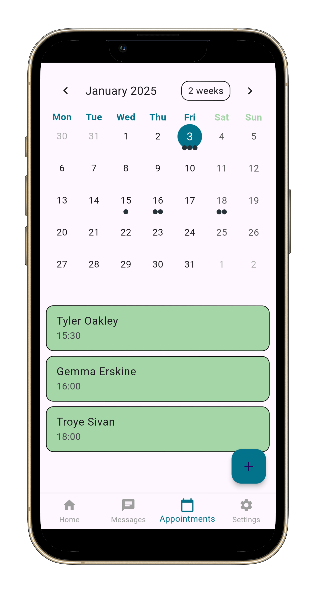

# 🏥 PhysioHub

**A Flutter-based mobile app designed to connect physiotherapists with their patients.**  
Manage bookings, track recovery exercises, and streamline communication in one place.

## 🚀 Features
- Patient sign-in and therapist dashboard
- Firebase authentication
- Real-time updates and messaging
- Exercise tracking and reminders
- Appointment management

## 📸 Screenshots
| Login Screen | Exercises | Calendar |
|--------------|-----------|------------------|
|  |  |  |

## 🛠 Tech Stack
- **Flutter + Dart**
- **Firebase** (Auth, Firestore, etc.)
- **Provider** for state management

## 📦 Installation

```bash
git clone https://github.com/JayWoodroffe/physio_hub_flutter.git
cd physio_hub_flutter
flutter pub get
flutter run ```

## 🧠  Challenges and Learning
- Learning Dart and gaining confidence building the UI
- Implementing real-time Firestore syncing for patient updates
- Designing a scalable folder structure for larger apps

## 📚 Future Plans
- Improve the chat feature between patients and physiotherapists (allow the uploading of images and videos)
- Push notifications to remind patients when to do their exercises
- Deploy to Play Store
